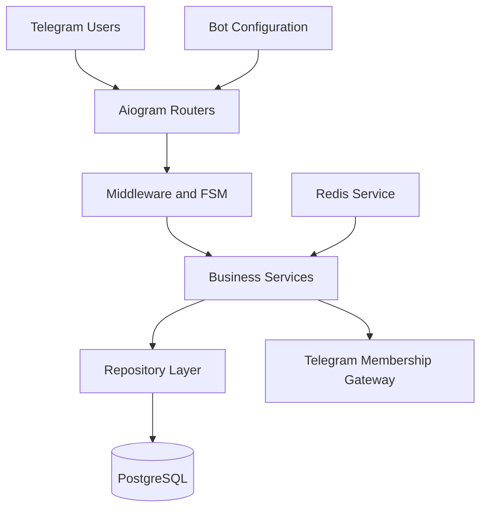

# Telegram VIP Bot

### White-Label Membership and Premium Content Automation Platform

A production-oriented Telegram bot platform for managing gated communities, VIP categories, member onboarding, premium content, referrals, and administrative workflows. The project uses a layered asynchronous architecture and can be configured for different client brands without modifying the application code.


## Overview

Telegram VIP Bot is a reusable backend for operating branded Telegram membership communities. It combines Telegram-native user experiences with persistent membership data, administrator controls, channel-access enforcement, configurable content screens, and database-backed operational records.

The codebase separates Telegram routers, business services, repositories, gateways, middleware, and infrastructure concerns. This keeps client-specific branding in environment configuration while allowing the same application architecture to support multiple isolated deployments.

## Features

- White-label brand and administrator naming through environment variables
- Required-channel membership gate with invite-link support
- Guided onboarding connected to configurable VIP categories
- Persistent membership and user management
- Super-admin ownership and multi-admin management
- Role-aware administrative middleware and protected workflows
- Configurable VIP menus, display names, information, media, and registration flows
- Free-versus-VIP comparison screens
- Daily picks with live and pre-match content settings
- Referral tracking and user notification preferences
- Editable content screens and support details
- Live operational statistics and administrator audit logs
- Multi-language interface infrastructure
- Structured application logging
- Alembic-managed PostgreSQL schema migrations
- Isolated Docker Compose deployments for multiple client brands
- Automatic service recovery with `restart: unless-stopped`

## Architecture



### Request flow

1. Aiogram receives an update and routes it to the appropriate user or administrator handler.
2. Middleware applies membership and administrator access rules.
3. Finite-state workflows collect multi-step configuration input.
4. Service classes apply business rules without coupling them to Telegram handlers.
5. Repository classes persist users, memberships, VIP categories, referrals, settings, and audit events in PostgreSQL.
6. Gateway adapters isolate Telegram membership checks from the domain logic.

## Technology Stack

| Area | Technologies |
|---|---|
| Language | Python 3.12 |
| Telegram framework | aiogram 3 |
| Data validation | Pydantic 2, pydantic-settings |
| Database | PostgreSQL 16, SQLAlchemy 2, asyncpg |
| Migrations | Alembic |
| Runtime service | Redis 7 |
| Logging | structlog |
| Infrastructure | Docker, Docker Compose, Linux |
| Quality tooling | Pytest, Ruff, mypy |

## Quick Start with Docker

### Requirements

- Docker Desktop or Docker Engine
- Docker Compose
- A Telegram bot token created through [BotFather](https://t.me/BotFather)
- Your Telegram numeric user ID for initial owner access

### 1. Clone the repository

```bash
git clone https://github.com/Adityagithubhack/telegram-vip-bot.git
cd telegram-vip-bot
```

### 2. Create the environment file

```bash
cp .env.example .env
```

At minimum, replace these values in `.env`:

```dotenv
BOT_TOKEN=your_telegram_bot_token
SUPER_ADMIN_TELEGRAM_ID=your_numeric_telegram_id
BRAND_NAME=YOUR SPORTS BRAND
ADMIN_BRAND_NAME=YOUR BRAND ADMIN
POSTGRES_PASSWORD=use_a_strong_unique_password
```

If the bot requires users to join a channel, also configure:

```dotenv
REQUIRED_CHANNEL_USERNAME=@your_channel
REQUIRED_CHANNEL_INVITE_URL=https://t.me/your_channel
```

### 3. Start the data services

```bash
docker compose up -d postgres redis
```

### 4. Apply database migrations

```bash
docker compose run --rm bot alembic upgrade head
```

### 5. Start the bot

```bash
docker compose up -d bot
```

### 6. Verify the deployment

```bash
docker compose ps
docker compose logs -f bot
```

Open the bot in Telegram and send `/start`.

## Bot Commands

| Command | Purpose |
|---|---|
| `/start` | Start the onboarding and premium-access experience |
| `/menu` | Open the main menu |
| `/vip` | Explore available VIP options |
| `/myvip` | Open the member's VIP dashboard |
| `/dailypicks` | View the current VIP picks |
| `/compare` | Compare free and VIP access |
| `/howitworks` | Learn how VIP access works |
| `/language` | Change the interface language |
| `/support` | Open configured support information |

## Configuration

| Variable | Purpose | Example or default |
|---|---|---|
| `ENVIRONMENT` | Runtime environment | `development` |
| `LOG_LEVEL` | Application log level | `INFO` |
| `BOT_TOKEN` | Telegram Bot API token | Required |
| `BOT_MODE` | Telegram update mode | `polling` |
| `DATABASE_URL` | Async PostgreSQL connection URL | Local development URL |
| `REDIS_URL` | Redis connection URL | `redis://localhost:6379/0` |
| `SUPER_ADMIN_TELEGRAM_ID` | Initial bot owner ID | Required for owner bootstrap |
| `BRAND_NAME` | User-facing product name | `YOUR SPORTS BRAND` |
| `ADMIN_BRAND_NAME` | Administrator-facing brand name | `YOUR BRAND ADMIN` |
| `REQUIRED_CHANNEL_USERNAME` | Required Telegram channel | Optional |
| `REQUIRED_CHANNEL_INVITE_URL` | Required-channel invite URL | Optional |
| `COMPOSE_PROJECT_NAME` | Isolated Docker deployment name | `telegram_vip_client` |
| `POSTGRES_DB` | PostgreSQL database name | `telegram_vip` |
| `POSTGRES_USER` | PostgreSQL user | `telegram_vip` |
| `POSTGRES_PASSWORD` | PostgreSQL password | Change before deployment |
| `POSTGRES_PORT` | Host PostgreSQL port | `5432` |
| `REDIS_PORT` | Host Redis port | `6379` |

`WEBHOOK_BASE_URL`, `WEBHOOK_PATH`, and `WEBHOOK_SECRET` are reserved for a future webhook deployment mode. The current application entry point implements polling mode.

## Multi-Client Deployment

Each client deployment should use a unique Compose project name, database password, and host port allocation. Keep a separate `.env` file for every deployment and never commit it to Git.

Example isolation settings:

```dotenv
COMPOSE_PROJECT_NAME=telegram_vip_client2
POSTGRES_PORT=5434
REDIS_PORT=6381
```

Start the isolated deployment from its own project directory:

```bash
docker compose up -d --build
```

Docker volumes preserve each deployment's PostgreSQL and Redis data independently.

## Database Migrations

Apply all migrations:

```bash
docker compose run --rm bot alembic upgrade head
```

View the current revision:

```bash
docker compose run --rm bot alembic current
```

Create a migration during development:

```bash
alembic revision --autogenerate -m "describe the schema change"
```

## Local Development

Create a virtual environment and install the project with development tools:

```bash
python3.12 -m venv .venv
source .venv/bin/activate
pip install --upgrade pip
pip install -e ".[dev]"
```

Start PostgreSQL and Redis with Docker, configure local connection URLs in `.env`, apply migrations, and run:

```bash
python app/main.py
```

### Quality checks

```bash
ruff check app tests
mypy app
pytest
```

## Project Structure

```text
telegram-vip-bot/
├── app/
│   ├── bot/
│   │   ├── middlewares/    Access and membership enforcement
│   │   ├── routers/        User and administrator update handlers
│   │   ├── states/         Multi-step FSM workflows
│   │   └── views/          Telegram presentation builders
│   ├── config/             Validated environment settings
│   ├── core/               Logging and shared application utilities
│   ├── gateways/           External Telegram membership adapter
│   ├── i18n/               Translation infrastructure
│   ├── infra/              Database and Redis infrastructure
│   ├── repositories/       Persistent data-access layer
│   ├── services/           Business and administration logic
│   ├── dispatcher.py       Aiogram dependency and router assembly
│   └── main.py             Application entry point
├── migrations/             Alembic schema history
├── scripts/                Client setup and data-seeding utilities
├── tests/                  Automated tests
├── Dockerfile
├── docker-compose.yml
├── alembic.ini
└── pyproject.toml
```

## Security Notes

- Never commit `.env`, bot tokens, database passwords, webhook secrets, or real administrator IDs.
- Rotate a token immediately if it is exposed in logs, commits, screenshots, or chat messages.
- Use a unique PostgreSQL password for every deployment.
- Keep PostgreSQL and Redis unexposed unless external access is explicitly required and protected.
- Grant administrator access only to verified Telegram user IDs.
- Review audit records and container logs when investigating privileged actions.

## Current Scope

- Polling mode is implemented and used by the current application entry point.
- Webhook configuration fields are present, but webhook serving is not implemented yet.
- Client branding is environment-driven; client secrets and production environment files are intentionally excluded from the repository.

## Roadmap

- Webhook deployment with secret-token verification
- Automated CI checks for Ruff, mypy, Pytest, and Docker builds
- Expanded service and repository test coverage
- Payment-provider integration through isolated adapters
- Additional localization options
- Operational health checks and metrics

## Author

**Aditya Singh**

- GitHub: [@Adityagithubhack](https://github.com/Adityagithubhack)

## License

No open-source license is currently provided. The source code is publicly available for portfolio review; reuse, redistribution, and commercial use require permission from the author.
